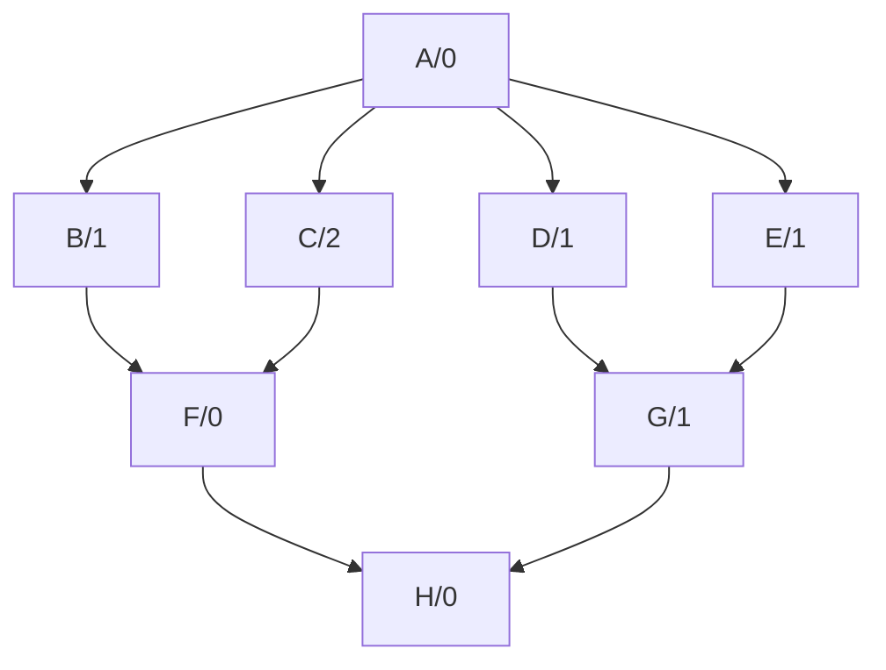

# static-graph

[![Crates.io][crates-badge]][crates-url]
[![License][license-badge]][license-url]
[![Build Status][actions-badge]][actions-url]

[crates-badge]: https://img.shields.io/crates/v/static-graph.svg
[crates-url]: https://crates.io/crates/static-graph
[license-badge]: https://img.shields.io/crates/l/static-graph.svg
[license-url]: #license
[actions-badge]: https://github.com/volo-rs/static-graph/actions/workflows/ci.yaml/badge.svg
[actions-url]: https://github.com/volo-rs/static-graph/actions

This crate provides the ability to generate static graphs by analysing the node dependencies in DSL. It allows only one input and one output in a graph, and independent nodes can run in maximum parallel.

For example, in the following graph(the number represents the execution time of the node), run it in serial will take 6 seconds, but run it in maximum parallel will just take 2 seconds.



## Usage

Add this to your `Cargo.toml`:

```toml
[build-dependencies]
static-graph = "0.3"
```

## Example

Write a graph description in `example.graph` file:

```txt
node E -> (X, Y) {
    #[default = "crate::Custom::new"]
    custom: crate::Custom,
}

node X -> O {
    x: list<string>,
}

node Y -> O {
    y: map<i32, string>,
}

node O {
    #[editable = "true"]
    o: string,
}

graph G(E)
```

Then, in `build.rs`:

```rust
fn main() {
    static_graph::configure()
        .file_name("example.rs")
        .compile("example.graph")
        .unwrap();
}
```
> if you want to generate a mermaid file, just set `enable_mermaid(true)` 

Finally, in `main.rs` write your own logic for your nodes in the graph. The generated code will be in the `OUT_DIR` directory by default, the graph name is `G`, and the nodes name are `E`, `X`, `Y`, `O`. You should implement the `Runnable` trait for each node, and then you can automatically run the graph in maximum parallel by calling `G::new().run()`.

```rust
use std::{
    sync::Arc,
    time::{Duration, Instant},
};

use gen_graph::{Runnable, E, G, O, X, Y};

#[allow(warnings, clippy::all)]
pub mod gen_graph {
    static_graph::include_graph!("example.rs");
}

#[derive(Default)]
pub struct Custom;

impl Custom {
    pub fn new() -> Self {
        Self
    }
}

#[tokio::main]
async fn main() {
    let start = Instant::now();
    let resp = G::new()
        .run::<Request, EResponse, XResponse, YResponse, OResponse, ()>(Request {
            msg: "**Hello, world!**".to_string(),
            user_age: 18,
        })
        .await;
    let duration = start.elapsed();

    println!("Time elapsed is {duration:?}, resp is {resp:?}");
}

#[derive(Clone)]
pub struct Request {
    msg: String,
    user_age: u8,
}

#[derive(Clone)]
pub struct EResponse(Duration);

impl Runnable<Request, ()> for E {
    type Resp = EResponse;
    type Error = ();

    async fn run(&self, _req: Request, _prev_resp: ()) -> Result<Self::Resp, Self::Error> {
        tokio::time::sleep(Duration::from_secs(1)).await;
        Ok(EResponse(Duration::from_secs(1)))
    }
}

#[derive(Clone)]
pub struct XResponse(bool);

impl Runnable<Request, EResponse> for X {
    type Resp = XResponse;
    type Error = ();

    async fn run(&self, req: Request, prev_resp: EResponse) -> Result<Self::Resp, Self::Error> {
        tokio::time::sleep(prev_resp.0).await;
        Ok(XResponse(!req.msg.contains('*')))
    }
}

#[derive(Clone)]
pub struct YResponse(bool);

impl Runnable<Request, EResponse> for Y {
    type Resp = YResponse;
    type Error = ();

    async fn run(&self, req: Request, prev_resp: EResponse) -> Result<Self::Resp, Self::Error> {
        tokio::time::sleep(prev_resp.0).await;
        Ok(YResponse(req.user_age >= 18))
    }
}

#[derive(Clone, Debug)]
pub struct OResponse(String);

impl Runnable<Request, (XResponse, YResponse)> for O {
    type Resp = OResponse;
    type Error = ();

    async fn run(
        &self,
        req: Request,
        prev_resp: (XResponse, YResponse),
    ) -> Result<Self::Resp, Self::Error> {
        self.o.store(Arc::new(req.msg.clone()));
        println!("O: {:#?}", self.o.load());
        if prev_resp.0 .0 && prev_resp.1 .0 {
            Ok(OResponse(req.msg))
        } else {
            Ok(OResponse("Ban".to_string()))
        }
    }
}
```

## License

Volo is dual-licensed under the MIT license and the Apache License (Version 2.0).

See [LICENSE-MIT](https://github.com/volo-rs/.github/blob/main/LICENSE-MIT) and [LICENSE-APACHE](https://github.com/volo-rs/.github/blob/main/LICENSE-APACHE) for details.

## Community

- Email: [volo@cloudwego.io](mailto:volo@cloudwego.io)
- How to become a member: [COMMUNITY MEMBERSHIP](https://github.com/cloudwego/community/blob/main/COMMUNITY_MEMBERSHIP.md)
- Issues: [Issues](https://github.com/volo-rs/.github/issues)
- Feishu: Scan the QR code below with [Feishu](https://www.feishu.cn/) or [click this link](https://applink.feishu.cn/client/chat/chatter/add_by_link?link_token=7f0oe1a4-930f-41f9-808a-03b89a681020) to join our CloudWeGo Volo user group.

  
